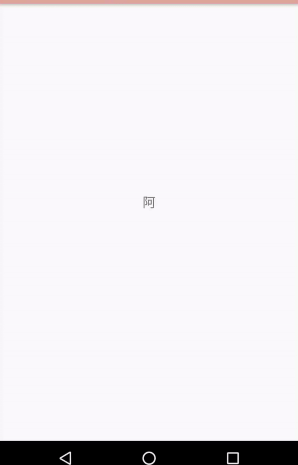

## typer 是一个模拟打字机效果的类
上面是效果图
## 使用方法
1. 下载Typer.kt复制到自己的项目中
2. 对需要打字机效果的textview设置如下代码

```kotlin
Typer.target(type_text)
                .input("阿朋：")
                .sleep(1000)
                .input("你好,")
                .speed(200)
                .sleep(800)
                .input("好久不见，最近")
                .speed(200)
                .input("还好吗")
                .sleep(1000)
                .delete(3)
                .sleep(1000)
                .input("过得怎么样?\n")
                .sleep(500)
                .input("我")
                .speed(100)
                .input("还是老样子，")
                .sleep(1000)
                .speed(220)
                .input("快过年了，新年快乐")
                .start()

```
### Doc
.input
输入的字符串

.sleep
暂停的毫秒数

.speed 
输入速度，字符间的时间间隔，数值越大，输入速度越慢

.delete 
删除指定个数字符串

### feature
调整好参数，模拟打字机效果。